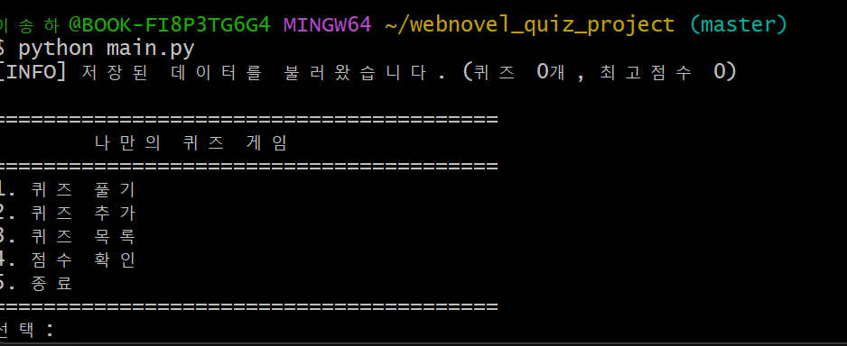
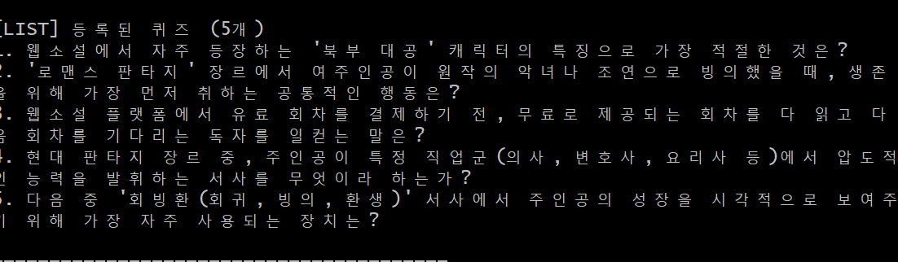
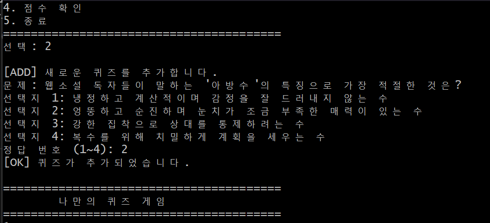
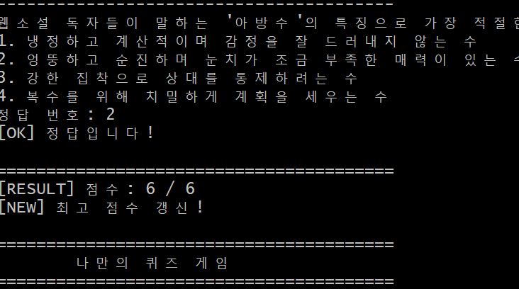
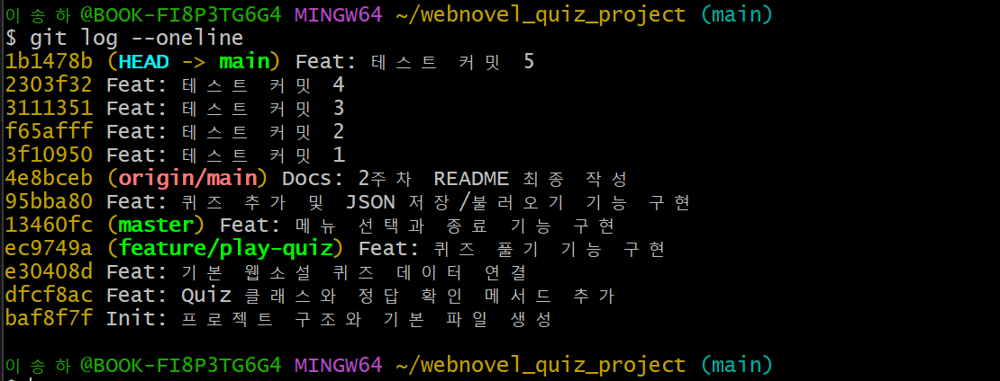
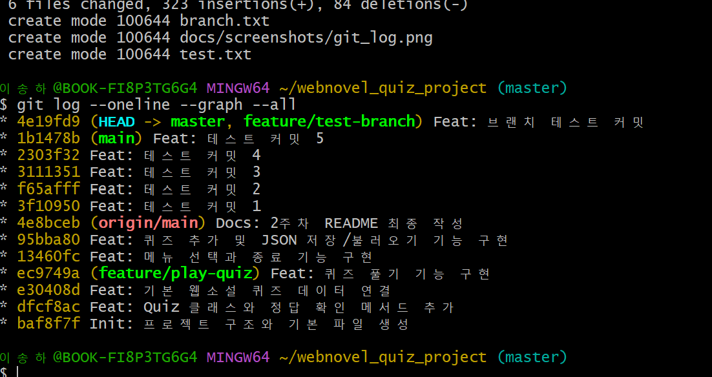
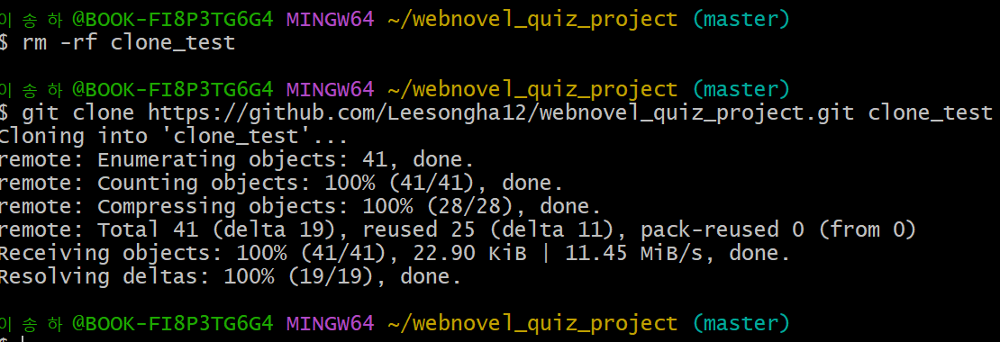
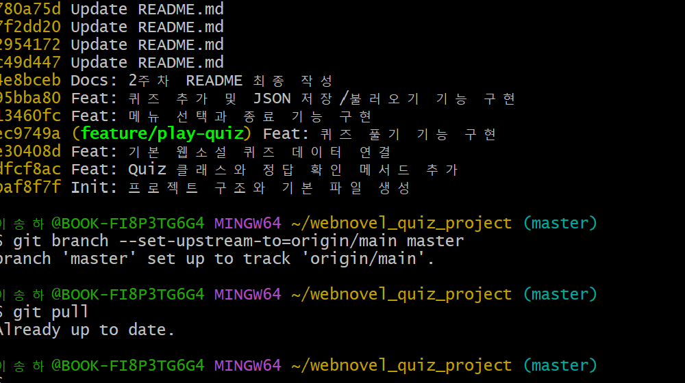

# Web Novel Quiz Project

## 1. 프로젝트 개요

본 프로젝트는 Python을 활용하여 제작한 콘솔 기반 퀴즈 게임입니다.  
사용자는 메뉴를 통해 퀴즈를 풀고, 새로운 퀴즈를 추가하며, 등록된 퀴즈 목록과 최고 점수를 확인할 수 있습니다.  
또한 `state.json` 파일을 활용하여 프로그램 종료 후에도 데이터가 유지되도록 구현하였습니다.

본 과제의 목표는 단순히 동작하는 프로그램을 만드는 것에 그치지 않고,  
다음 내용을 실제 코드와 Git 작업 흐름으로 확인하는 것입니다.

- Python 기본 문법 활용
- 클래스 기반 구조 설계
- JSON 파일 저장/불러오기
- 입력 검증 및 예외 처리
- Git을 통한 기능 단위 버전 관리

---

## 2. 퀴즈 주제 선정 이유

퀴즈 주제는 웹소설 장르 상식으로 선정하였습니다.  
평소 웹소설을 자주 접해 해당 분야에 대한 이해도가 높았기 때문에 문제를 직접 구성하기에 적합하다고 판단했습니다.  
또한 하나의 장르로 통일된 문제를 구성하면 프로그램의 일관성과 완성도를 높일 수 있다고 생각했습니다.

---

## 3. 실행 방법

아래 명령어를 입력하여 프로그램을 실행할 수 있습니다.

```bash
python main.py
```

---

## 4. 기능 목록

- 퀴즈 풀기
- 퀴즈 추가
- 퀴즈 목록 확인
- 최고 점수 확인
- 프로그램 종료
- JSON 파일을 통한 데이터 저장 및 불러오기
- 잘못된 입력 검증
- 파일 손상 시 기본 데이터 복구

---

## 5. 파일 구조

```text
webnovel_quiz_project/
├── main.py
├── quiz.py
├── quiz_game.py
├── state.json
├── README.md
└── docs/
    └── screenshots/
        ├── git_log.png
        ├── git_graph.png
        ├── git_clone.png
        ├── git_pull.png
        ├── menu.png
        ├── add_quiz.png
        ├── list.png
        └── score.png
```

각 파일의 역할은 다음과 같습니다.

- `main.py` : 프로그램 시작점
- `quiz.py` : `Quiz` 클래스와 기본 퀴즈 데이터 정의
- `quiz_game.py` : 메뉴, 게임 진행, 입력 처리, 저장/불러오기 담당
- `state.json` : 퀴즈와 최고 점수 저장
- `README.md` : 프로젝트 설명 문서

---

## 6. 클래스 설계 및 책임 분리

### 6-1. Quiz 클래스

`Quiz` 클래스는 **문제 하나를 표현하는 데이터 단위**입니다.  
문제 내용, 선택지, 정답을 하나로 묶고, 출력과 정답 확인 기능을 담당합니다.

```python
class Quiz:
    def __init__(self, question, choices, answer):
        self.question = question
        self.choices = choices
        self.answer = answer

    def display(self):
        print(self.question)
        for i, choice in enumerate(self.choices, start=1):
            print(f"{i}. {choice}")

    def check_answer(self, user_answer):
        return user_answer == self.answer
```

### 6-2. QuizGame 클래스

`QuizGame` 클래스는 **게임 전체 흐름을 제어하는 클래스**입니다.  
메뉴 출력, 입력 검증, 퀴즈 진행, 점수 계산, JSON 저장/불러오기를 담당합니다.

```python
class QuizGame:
    def __init__(self):
        self.file_path = "state.json"
        self.quizzes = []
        self.best_score = 0
        self.load_data()
```

### 6-3. 책임을 나눈 기준

기능을 나눈 기준은 **단일 책임 원칙(SRP)** 입니다.

- `Quiz` : 문제 데이터와 문제 자체의 동작
- `QuizGame` : 사용자와 상호작용하는 게임 전체 진행
- `save_data()` / `load_data()` : 저장 전용 로직
- `get_menu_choice()` : 입력 검증 전용 로직
- `play_quiz()` : 퀴즈 진행 및 점수 계산 로직

이처럼 책임을 나누면 수정 시 영향 범위를 줄일 수 있고, 기능별로 테스트하기도 쉬워집니다.

---

## 7. 메뉴 및 기능 실행 구조

```python
def run(self):
    while True:
        self.show_menu()
        choice = self.get_menu_choice()

        if choice == 1:
            self.play_quiz()
        elif choice == 2:
            self.add_quiz()
        elif choice == 3:
            self.show_quiz_list()
        elif choice == 4:
            self.show_best_score()
        elif choice == 5:
            print("종료합니다.")
            break
```

이 구조를 사용한 이유는 콘솔 프로그램에서 메뉴를 반복적으로 보여주고,  
사용자가 종료를 선택하기 전까지 프로그램을 계속 실행하기 위해서입니다.

### 메뉴 실행 화면


---

## 8. 입력 검증 및 예외 처리

### 8-1. 메뉴 입력 검증

```python
def get_menu_choice(self):
    while True:
        user_input = input("선택: ").strip()

        if user_input == "":
            print("⚠️ 빈 입력입니다. 다시 입력하세요.")
            continue

        if not user_input.isdigit():
            print("⚠️ 숫자를 입력하세요.")
            continue

        choice = int(user_input)

        if 1 <= choice <= 5:
            return choice
        else:
            print("⚠️ 1~5 사이 숫자를 입력하세요.")
```

이 메서드는 다음 오류를 처리합니다.

- 공백 입력
- 빈 입력
- 문자 입력
- 허용 범위를 벗어난 숫자 입력

### 8-2. 파일 손상 대응

```python
def load_data(self):
    if not os.path.exists(self.file_path):
        self.quizzes = get_default_quizzes()
        self.best_score = 0
        return

    try:
        with open(self.file_path, "r", encoding="utf-8") as f:
            data = json.load(f)
    except:
        print("⚠️ 파일이 손상되어 기본 데이터로 복구합니다.")
        self.quizzes = get_default_quizzes()
        self.best_score = 0
        return
```

이렇게 `try/except`를 사용하는 이유는 다음과 같습니다.

- 파일이 없을 수 있음
- JSON 형식이 깨졌을 수 있음
- 읽기 도중 오류가 발생할 수 있음

즉, 프로그램이 비정상 종료되지 않고 기본 상태로 복구되도록 하기 위함입니다.

---

## 9. Ctrl+C / EOF 안전 종료 처리

콘솔 프로그램은 실행 도중 `Ctrl+C(KeyboardInterrupt)` 또는 `EOFError`가 발생할 수 있습니다.  
이 경우 프로그램이 갑자기 종료되면 저장되지 않은 데이터가 유실될 수 있습니다.

이를 방지하기 위해 아래와 같은 안전 종료 처리가 필요합니다.

```python
def run(self):
    try:
        while True:
            self.show_menu()
            choice = self.get_menu_choice()

            if choice == 1:
                self.play_quiz()
            elif choice == 2:
                self.add_quiz()
            elif choice == 3:
                self.show_quiz_list()
            elif choice == 4:
                self.show_best_score()
            elif choice == 5:
                print("종료합니다.")
                break
    except (KeyboardInterrupt, EOFError):
        print("\n⚠️ 입력이 중단되어 안전하게 종료합니다.")
        self.save_data()
```

현재 과제에서 중요한 것은 단순히 종료하는 것이 아니라,  
**종료 전에 가능한 범위에서 데이터를 저장하고 프로그램을 마무리하는 것**입니다.

---

## 10. JSON 저장 및 불러오기 구조

### 10-1. 저장 구조

```python
def save_data(self):
    data = {
        "quizzes": [
            {
                "question": q.question,
                "choices": q.choices,
                "answer": q.answer
            } for q in self.quizzes
        ],
        "best_score": self.best_score
    }

    with open(self.file_path, "w", encoding="utf-8") as f:
        json.dump(data, f, ensure_ascii=False, indent=4)
```

### 10-2. 불러오기 구조

```python
def load_data(self):
    with open(self.file_path, "r", encoding="utf-8") as f:
        data = json.load(f)
```

### 10-3. 이 구조를 선택한 이유

현재 데이터 구조는 다음과 같습니다.

```json
{
    "quizzes": [
        {
            "question": "문제",
            "choices": ["선택지1", "선택지2", "선택지3", "선택지4"],
            "answer": 3
        }
    ],
    "best_score": 5
}
```

이 구조를 선택한 이유는 다음과 같습니다.

- `quizzes` : 여러 문제를 리스트로 관리하기 쉬움
- `question`, `choices`, `answer` : 퀴즈 한 문제를 표현하는 최소 단위
- `best_score` : 최고 점수를 별도 필드로 분리하면 접근이 쉬움

즉, 문제 데이터와 점수 데이터를 분리하여 **확장성과 가독성**을 확보한 구조입니다.

---

## 11. 기본 퀴즈 5개 증빙

기본 퀴즈는 최소 5개 이상 포함되도록 구성하였습니다.

```python
def get_default_quizzes():
    return [
        Quiz(
            "웹소설에서 자주 등장하는 '북부 대공' 캐릭터의 특징으로 가장 적절한 것은?",
            [
                "밝고 사교적인 성격으로 파티를 즐긴다",
                "따뜻하고 감정 표현이 풍부하다",
                "냉정하고 과묵하며 강한 권력을 가진다",
                "평범한 시민 출신으로 모험을 떠난다"
            ],
            3
        ),
        Quiz(
            "'로맨스 판타지' 장르에서 여주인공이 원작의 악녀나 조연으로 빙의했을 때, 생존을 위해 가장 먼저 취하는 공통적인 행동은?",
            [
                "원작 남주와 결혼하기",
                "파혼 선언 및 자산 확보",
                "마법 학교 입학",
                "황제 암살 계획"
            ],
            2
        ),
        Quiz(
            "웹소설 플랫폼에서 유료 회차를 결제하기 전, 무료로 제공되는 회차를 다 읽고 다음 회차를 기다리는 독자를 일컫는 말은?",
            [
                "유료 독자",
                "연독자",
                "기다무 이용자",
                "하차 독자"
            ],
            3
        ),
        Quiz(
            "현대 판타지 장르 중, 주인공이 특정 직업군(의사, 변호사, 요리사 등)에서 압도적인 능력을 발휘하는 서사를 무엇이라 하는가?",
            [
                "무협물",
                "전문가물",
                "아포칼립스물",
                "영지물"
            ],
            2
        ),
        Quiz(
            "다음 중 '회빙환(회귀, 빙의, 환생)' 서사에서 주인공의 성장을 시각적으로 보여주기 위해 가장 자주 사용되는 장치는?",
            [
                "종이 지도",
                "상태창(시스템창)",
                "전령구",
                "수정구슬"
            ],
            2
        )
    ]
```

### 퀴즈 목록 실행 화면


---

## 12. 프로그램 실행 예시

```text
========================================
        🎯 나만의 퀴즈 게임 🎯
========================================
1. 퀴즈 풀기
2. 퀴즈 추가
3. 퀴즈 목록
4. 점수 확인
5. 종료
========================================
선택:
```

### 퀴즈 추가 화면


### 점수 확인 화면


---

## 13. Git 작업 흐름

### 13-1. 커밋을 나눈 기준

커밋은 **기능 단위**로 나누었습니다.  
예를 들어 다음과 같은 기준을 사용했습니다.

- 프로젝트 초기 구조 생성
- `Quiz` 클래스 작성
- 기본 퀴즈 데이터 연결
- 퀴즈 풀기 기능 구현
- 메뉴 및 점수 기능 구현
- README 문서 보완
- Git 증빙 스크린샷 추가

이렇게 나눈 이유는 어떤 기능이 언제 추가되었는지 추적하기 쉽게 만들기 위해서입니다.

### 13-2. 커밋 메시지 규칙

커밋 메시지는 작업 성격이 드러나도록 다음 접두어를 사용했습니다.

- `Init:` 초기 설정
- `Feat:` 기능 추가
- `Docs:` 문서 수정
- `Fix:` 오류 수정
- `Refactor:` 구조 개선

예시:

```text
Init: 프로젝트 구조와 기본 파일 생성
Feat: Quiz 클래스와 정답 확인 메서드 추가
Feat: 기본 웹소설 퀴즈 데이터 연결
Feat: 퀴즈 풀기 기능 구현
Feat: 메뉴 선택과 종료 기능 구현
Docs: 2주차 README 최종 작성
Docs: Git 증빙 스크린샷 추가
```

### 13-3. 브랜치를 분리한 이유

브랜치를 분리한 이유는 **기능 개발과 안정 버전을 분리하기 위해서**입니다.  
예를 들어 퀴즈 풀기 기능을 개발할 때 `feature/play-quiz` 브랜치에서 작업하면,  
메인 브랜치의 안정적인 상태를 유지한 채 새 기능을 실험하고 수정할 수 있습니다.

### 13-4. merge의 의미

`merge`는 기능 브랜치에서 완성된 작업을 메인 브랜치에 합치는 과정입니다.  
즉, 독립적으로 개발한 기능을 최종 버전에 반영한다는 의미입니다.

예시 명령어:

```bash
git checkout -b feature/play-quiz
git commit -m "Feat: 퀴즈 풀기 기능 구현"
git checkout main
git merge feature/play-quiz
```

---

## 14. Git 증빙

### 14-1. git log --oneline

커밋 수와 기능 단위 커밋 내역을 확인할 수 있습니다.



### 14-2. git log --oneline --graph --all

브랜치 생성 및 병합 흐름을 확인할 수 있습니다. 가지가 제대로 출력되지 않았으나, 현재 문제 해결해서 정상 출력됩니다.



### 14-3. git clone

원격 저장소를 복제한 실행 결과입니다.



### 14-4. git pull

원격 저장소의 최신 변경사항을 가져온 실행 결과입니다.



---

## 15. 스크린샷 증빙 항목

실제 제출 시 아래 스크린샷을 첨부하였습니다.

- 프로그램 메뉴 실행 화면
- 퀴즈 추가 화면
- 퀴즈 목록 화면
- 점수 확인 화면
- `git log --oneline` 결과
- `git log --oneline --graph --all` 결과
- `git clone` 실행 화면
- `git pull` 실행 화면

예시 저장 위치:

```text
docs/screenshots/menu.png
docs/screenshots/add_quiz.png
docs/screenshots/list.png
docs/screenshots/score.png
docs/screenshots/git_log.png
docs/screenshots/git_graph.png
docs/screenshots/git_clone.png
docs/screenshots/git_pull.png
```

---

## 16. 핵심 기술 원리 적용

### 16-1. 클래스를 사용한 이유와 함수만 사용할 때와의 차이

클래스를 사용한 이유는 **데이터와 기능을 함께 묶기 위해서**입니다.  
예를 들어 문제 하나는 질문, 선택지, 정답이라는 데이터를 가지며, 출력과 정답 확인 기능도 필요합니다.  
이때 `Quiz` 클래스로 묶으면 문제 단위로 다루기 쉬워집니다.

반대로 함수만 사용하면 관련 데이터가 여러 곳에 흩어져 관리가 어려워질 수 있습니다.

### 16-2. JSON을 사용한 이유

JSON은 텍스트 기반이라 사람이 읽기 쉽고, Python에서 `json` 모듈로 쉽게 처리할 수 있습니다.  
또한 별도의 데이터베이스 없이도 프로그램 종료 후 데이터를 유지할 수 있어, 이번 과제 규모에 적합하다고 판단했습니다.

### 16-3. try/except가 필요한 이유

파일 입출력에서는 다음과 같은 실패가 발생할 수 있습니다.

- 파일 없음
- JSON 형식 손상
- 읽기/쓰기 오류

이 경우 `try/except`가 없으면 프로그램이 즉시 종료될 수 있습니다.  
따라서 오류가 나더라도 기본 데이터 복구나 안전 종료가 가능하도록 예외 처리가 필요합니다.

### 16-4. 브랜치 분리와 병합의 의미

브랜치를 분리하면 새로운 기능을 개발하면서도 메인 브랜치의 안정성을 유지할 수 있습니다.  
기능이 완성되면 merge를 통해 그 결과를 메인 브랜치에 합칩니다.  
즉, 브랜치는 “독립 개발 공간”, merge는 “검토 후 반영”의 의미를 가집니다.

---

## 17. 요구사항 변경 시 수정 지점 분석

### 17-1. 정답 채점 방식이 바뀌는 경우

예를 들어 “정답 1개당 20점”이 아니라 “정답 수 + 시간 가중치”로 바뀐다면,  
가장 먼저 수정해야 할 곳은 `QuizGame` 클래스의 `play_quiz()` 메서드입니다.  
이 메서드가 현재 점수 계산과 최고 점수 갱신을 담당하기 때문입니다.

### 17-2. 선택지 개수가 4개에서 5개로 바뀌는 경우

가장 먼저 수정해야 할 곳은 다음입니다.

- `Quiz` 클래스에서 선택지를 출력하는 `display()` 메서드
- `add_quiz()` 메서드에서 선택지 입력 받는 반복 횟수
- 입력 검증 범위(현재 1~4)를 확인하는 부분
- 기본 퀴즈 데이터 구조

즉, 퀴즈 구조 자체가 바뀌는 요구사항은 `Quiz`와 `QuizGame` 양쪽을 함께 수정해야 합니다.

### 17-3. 데이터 필드가 추가되는 경우

예를 들어 힌트(`hint`)를 추가한다면:

- `Quiz` 클래스의 `__init__`
- `save_data()`
- `load_data()`
- 기본 퀴즈 데이터

를 먼저 수정해야 합니다.

---

## 18. 심층 분석

### 18-1. 퀴즈가 1000개 이상으로 늘어나면?

현재 방식은 모든 데이터를 JSON 파일 하나에 저장하고 한 번에 불러옵니다.  
문제가 많아지면 파일 크기가 커지고, 읽기/쓰기 속도와 관리 효율이 떨어질 수 있습니다.  
이 경우 데이터베이스(SQLite 등)를 사용하는 방식이 더 적합합니다.

### 18-2. state.json이 손상되면?

현재는 `try/except`로 파싱 실패를 감지하고, 기본 퀴즈 데이터로 복구하도록 설계했습니다.  
추가로 더 보완하려면 다음 방법도 가능합니다.

- 저장 전 백업 파일 생성
- 손상 시 마지막 정상 백업 복원
- 사용자에게 복구 여부 선택권 제공

### 18-3. 기능이 더 늘어나면?

기능이 많아질수록 `QuizGame` 클래스가 너무 커질 수 있습니다.  
이 경우 저장 전용 클래스, 입력 전용 함수, UI 출력 전용 모듈 등으로 분리하여 리팩터링할 수 있습니다.

---

## 19. 1주차와의 연계

1주차에서는 개발 환경과 Git 기본 명령어를 학습하였고,  
2주차에서는 이를 기반으로 실제 Python 프로그램을 구현하였습니다.

즉, 1주차가 “개발 준비” 단계였다면,  
2주차는 “실제 프로그램 구현과 버전 관리 실습” 단계라고 볼 수 있습니다.

---

## 20. 결론

본 프로젝트를 통해 단순한 문법 학습을 넘어서 다음을 종합적으로 경험할 수 있었습니다.

- Python 기본 문법 활용
- 클래스 기반 설계
- JSON 데이터 영속성
- 입력 검증과 예외 처리
- Git 브랜치 및 커밋 관리

또한 과제를 통해 프로그램을 만들 때  
기능 구현뿐 아니라 **설계 이유, 증빙 자료, 버전 관리 흐름**까지 함께 정리하는 것이 중요하다는 점을 배울 수 있었습니다.
